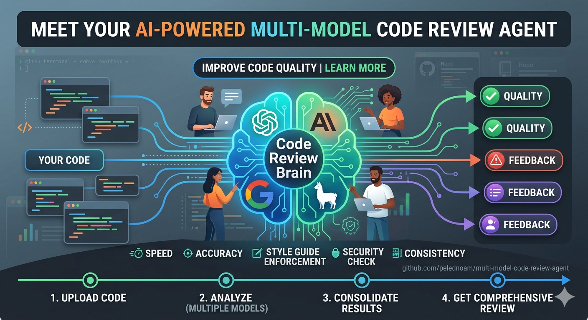

# Multi-Model Code Review Agent



A code review pipeline that runs multiple frontier LLMs in parallel,
each with a different review lens, preceded by a deterministic
preflight audit. Three modes:

- **Quick mode** (free): 2 Claude Code subagents with clean context.
  ~30 seconds. Use for every commit. Subagents run via the `Agent()`
  tool and use the parent Claude Code session's API allocation -- not
  the local `claude`/`codex`/`gemini` CLIs.
- **Full mode** (free or paid): 4 parallel reviewer subprocesses
  across providers using the locally installed CLIs by default. Free
  when `claude` + `codex` + `gemini` are installed. Hermes/Bedrock
  available as an opt-in for codebases that need data-at-rest.
  ~3-5 minutes. Use for pre-merge gates.
- **Convergence loop** (free or paid): runs full mode repeatedly,
  applying fixes via a clean-context merge agent, until no blocking
  findings remain (or the same findings appear twice -- "stuck"). Each
  round enforces a mandatory four-step CI gate before commit.

All three modes run the same preflight audit and spec-contract review
lens. Designed for codebases where static diff review alone misses
contract violations between code and signed artifacts.

## Why not just ask Claude Code to review?

When you ask Claude Code to review its own work -- or spawn a subagent
to do it -- you get a fast, convenient review. But it has structural
limitations that matter for high-stakes code:

**Same model, same blind spots.** Claude Code and its subagents all run
on the same model family. Every model has systematic blind spots shaped
by its training data and RLHF tuning. Running Opus, GPT-5.5, and
Gemini on the same diff surfaces findings that no single model catches
alone. In our testing, the spec-contract reviewer (Opus) caught manifest
drift that the correctness reviewer (GPT-5.5) missed, while GPT-5.5
caught dtype coercion bugs that Opus didn't flag.

**Contaminated context.** When the dev agent reviews its own output, it
has seen the implementation rationale, the rejected alternatives, and
the conversation leading to each decision. A reviewer with a clean
context -- seeing only the diff, the spec, and the audit output --
evaluates the code as a future reader would, not as the author.

**No separation of concerns.** The dev agent has write access, tool
access, and conversational momentum. A review-only agent with read-only
file access and no terminal cannot accidentally fix what it finds,
cannot be influenced by prior conversation, and cannot be prompted into
leniency by the author's explanations.

**No artifact awareness.** A code review in the same session sees the
diff but not the repo's signed manifests, artifact SHAs, or runtime
state. This pipeline runs a deterministic preflight audit that
machine-verifies manifest counts, feature dimensions, and artifact
integrity _before_ any LLM runs. In our testing, this caught a
782-vs-662 feature count mismatch that three rounds of same-session
review missed.

### What this pipeline adds

| Capability | Same-session | Quick mode | Full: CLIs | Full: Hermes |
|---|---|---|---|---|
| Clean context | no | yes | yes | yes |
| Deterministic preflight | no | yes | yes | yes |
| Artifact/manifest audit | no | yes | yes | yes |
| Coverage-gap detection | no | yes | yes | yes |
| Per-reviewer attribution | no | 2 lenses | 4 lenses | 4 lenses |
| Write isolation | no | no | `--allowedTools` | `-t file` |
| Structured JSON schema | no | no | yes | yes |
| Review packet persistence | no | no | yes | yes |
| Cross-provider models | no | no | with Codex+Gemini | any provider |
| Mandatory CI gate before commit | no | no | yes | yes |
| Cost | free | free | free | ~$5-40 |
| Latency | instant | ~30s | ~3 min | ~5 min |

**When to use which:**
- **Quick mode**: every commit, rapid iteration (free, 30s)
- **Full mode with CLIs**: pre-merge gates when cost matters (free, 3min)
- **Full mode with Hermes**: high-stakes changes where Bedrock's
  data-at-rest guarantees matter

## Architecture

Each reviewer runs as a **separate OS process** with clean context --
no conversation history, no author bias.

```
Claude Code (or shell)
  |
  |  "review this" (quick), "full review" (full),
  |  or "run until converged" (loop)
  v
ensemble-review agent (docs/ensemble-review.md)
  |
  +-------- [convergence loop, repeats until converged or stuck] -------+
  |                                                                    |
  |  1. git diff | scrub_diff.py  (secrets never touch disk)            |
  |  2. review_preflight.py       (audit + coverage gaps)               |
  |  3. build context bundle      (docs, manifests, specs)              |
  |                                                                    |
  |  QUICK MODE:                         FULL MODE:                    |
  |  Agent(opus, spec-contract)          R1: hermes opus  OR  claude -p |
  |  Agent(sonnet, correctness)          R2: codex exec   (GPT-5.5)    |
  |  (2 subagents, free)                 R3: gemini       OR  claude -p |
  |                                      R4: hermes opus  OR  claude -p |
  |                                      (4 sessions, free or paid)    |
  |                                                                    |
  |  4. synthesize convergence report                                  |
  |  5. [loop only] merge agent applies suggested_fix's (clean ctx)    |
  |  6. [loop only] mandatory gate: ruff + format + mypy + pytest      |
  |  7. [loop only] auto-commit; fingerprint findings vs prev round    |
  +--------------------------------------------------------------------+
  v
User sees: preflight audit, blocking findings, convergence analysis
```

### Full mode routing

The agent auto-detects installed CLIs and picks the best backend for
each reviewer. **Local CLIs are the default** when installed --
they're free (existing subscriptions), reliable (each CLI manages its
own OAuth), and there's no good reason to spend Bedrock money on a
routine review.

Default precedence (no Bedrock opt-in):

| Reviewer | 1st choice | 2nd choice | 3rd choice |
|---|---|---|---|
| Security (Opus) | Claude CLI opus (free) | Hermes Opus (Bedrock, paid) | -- |
| Correctness | Codex CLI GPT-5.5 (free) | Claude CLI haiku (free) | Hermes Haiku (Bedrock) |
| Readability | Gemini CLI (free) | Claude CLI sonnet (free) | Hermes Sonnet (Bedrock) |
| Spec-contract (Opus) | Claude CLI opus (free) | Hermes Opus (Bedrock, paid) | -- |

### Bedrock opt-in (when you actually want Hermes)

For regulated codebases (FDA-path, HIPAA, anything where the diff
content must stay in your own AWS account), Bedrock's data-at-rest
guarantee matters. Opt in three ways:

1. **Verbal trigger**: say "hermes review", "bedrock review", or
   "isolated review" in Claude Code.
2. **Project-pinned**: create an empty file at `.use-hermes` in the
   project root. Every review in that project (CLI or convergence-
   loop) auto-uses Bedrock for Anthropic reviewers. The marker lives
   at repo root (not under `.claude/`) so it survives `.claude/`
   being gitignored and can be committed to share the policy.
3. **CLI flag**: `python scripts/review_until_converged.py
   --prefer-hermes` for the convergence loop.

When opted in, the precedence flips for Anthropic reviewers:

| Reviewer | 1st choice | 2nd choice | 3rd choice |
|---|---|---|---|
| Security (Opus) | Hermes Opus (Bedrock) | Claude CLI opus (free) | -- |
| Correctness | Hermes Haiku (Bedrock) | Codex CLI GPT-5.5 (free) | Claude CLI haiku (free) |
| Readability | Hermes Sonnet (Bedrock) | Gemini CLI (free) | Claude CLI sonnet (free) |
| Spec-contract (Opus) | Hermes Opus (Bedrock) | Claude CLI opus (free) | -- |

**With all CLIs installed** (claude + codex + gemini): the full review
is free, 3 provider families (Anthropic + OpenAI + Google).

## Coverage-gap detection

The preflight audit runs `pytest --cov-branch` against changed source
files (anything under `src/` or `research/` in the diff) and emits a
per-file `coverage_gaps` list with the actual uncovered line numbers
and branch arcs. The correctness reviewer is instructed to turn each
gap into a concrete test-case finding with `suggested_fix` containing
the runnable test code -- not a description.

The merge agent applies those test cases verbatim, so a single
convergence round closes the loop: detect uncovered code -> write the
test -> verify coverage rises -> pass the gate -> commit.

Coverage target is configurable (default 100%) via `COVERAGE_TARGET`
at the top of `scripts/review_preflight.py`. Set it to your project's
policy. Per-file opt-out is the standard `# pragma: no cover`.

## The convergence loop (external loop)

`scripts/review_until_converged.py` is an **external orchestration
loop** that wraps the inner review pipeline. Where quick and full
modes do one review pass, the convergence loop runs the full pipeline
**autonomously, round after round**, applying fixes between rounds
until no blocking findings remain. You start it once; it stops on its
own.

### What one round looks like

```
+------------------------------------------------------------------+
|  ROUND N                                                         |
|                                                                  |
|  1. preflight audit  (git state + manifests + coverage gaps)     |
|  2. 4 reviewers run IN PARALLEL on the current diff              |
|     (each in a separate OS process, clean context)               |
|  3. fingerprint findings -> compare with previous round          |
|  4. merge agent applies suggested_fix's IN A CLEAN CONTEXT       |
|     (separate Claude Code session; sees only the findings)       |
|  5. mandatory gate: ruff check + ruff format + mypy + pytest     |
|  6. auto-commit if --auto-commit                                 |
+------------------------------------------------------------------+
```

Each step writes evidence under `data/reviews/<timestamp>_<branch>/round-N/`:

- `audit.json` -- preflight output
- `prompt-{1..4}.txt` + `result-{1..4}.json` -- reviewer prompts and parsed findings
- `merge-prompt.txt` + `merge-output.json` -- what the merge agent saw and did
- `gate-output.txt` -- combined output of all four gate steps
- `convergence.json` -- diff vs previous round (new / repeated / resolved findings)

### Stop conditions

The loop exits on the first of:

| Code | Reason | When |
|---|---|---|
| 0 | **Converged** | No blocking findings remain -- only suggestions |
| 2 | **Stuck** | The same fingerprinted blocking findings appeared two rounds in a row (the reviewers want a fix the merge agent can't or won't make) |
| 3 | Merge agent failed | The merge subprocess crashed or returned non-JSON |
| 4 | Gate failed | Lint / format / mypy / pytest failed after fixes were applied |
| 5 | Commit/push failed | `--auto-commit` was set and git refused the push |
| 6 | Max rounds reached | `--max-rounds` (default 5) hit without convergence |

Exit 4 means the loop stops **without rolling back** -- the failing
diff is left in the working tree so you can inspect what went wrong.
Exit 2 is the most useful diagnostic: when two rounds produce
identical blocking findings, that's a signal that human judgment is
needed (the reviewers disagree with each other, or the fix requires
architectural changes the merge agent can't make).

### Why the merge agent runs in a clean context

The orchestrator (the convergence loop itself) has seen everything:
the prior rounds, the diff, the reviewer prompts, the failed gate
output. That context is contaminating -- if the orchestrator applied
fixes, it could be influenced by the rationale of an earlier rejected
fix or by the author's coding style from elsewhere in the diff.

The merge agent runs as a **separate Claude Code session** that sees
only:
- the current diff
- the parsed findings (file, issue, suggested_fix)
- the repo layout for navigation

It cannot see prior conversation, prior rounds, or the orchestrator's
notes. Findings either get applied verbatim or not at all -- there's
no negotiation in the loop.

### Invoking the loop

From Claude Code: "run until converged".

From the shell:

```bash
python scripts/review_until_converged.py \
    --repo /path/to/repo \
    --max-rounds 5 \
    --auto-commit            # commit after each successful round
```

Common patterns:

| Goal | Flags |
|---|---|
| One-shot: review + fix + gate, then stop | `--max-rounds 1` |
| Iterate locally without polluting git | omit `--auto-commit`, inspect each round's working tree |
| CI gate enforcement only | use the loop with `--max-rounds 1`; the gate runs unconditionally |
| Long autonomous session | `--max-rounds 10 --auto-commit` |

### When to use which mode

- **Quick mode**: every commit -- catch obvious problems, ~30s
- **Full mode**: pre-merge gate -- cross-provider diversity, ~3 min
- **Convergence loop**: when you want the agent to *finish* the
  review-and-fix cycle, not just identify problems. Good for: large
  refactors, post-rebase cleanup, "make this PR mergeable", catching
  regressions after a bulk auto-edit.

## Mandatory CI gate

Step 5 of each convergence-loop round is a **four-step gate** that
must pass before commit:

1. `ruff check .`
2. `ruff format --check .`
3. `mypy scripts/` (or the project's target)
4. `pytest tests/ -x -q`

If any step fails, the loop stops without committing -- the round's
`gate-output.txt` captures which step failed and why. Missing tools
(e.g. mypy not installed in the venv) cause a graceful skip with a
note rather than a failure, so the gate works in minimal environments.

The gate closes the lint/type/test loop: no review can recommend a
fix that breaks the gate without the loop catching it on the same
round. If a review's `suggested_fix` is applied and breaks tests, the
loop halts at the broken commit so you can inspect, instead of
silently moving on.

## Why four lenses?

| Reviewer | Focus |
|---|---|
| **Security & robustness** | Injection, auth, deserialization, secrets, race conditions |
| **Correctness & edge cases** | Off-by-one, shape mismatches, contract violations, logic errors |
| **Readability & performance** | Naming, dead code, N+1 I/O, memory growth, vectorization |
| **Spec-contract compliance** | Code vs signed artifacts, manifest drift, feature count mismatches, fallback logic that silently changes cohorts |

The spec-contract reviewer is the key differentiator. It catches the
class of failures that pure code review misses: a code path using 782
features when the signed manifest says 662, a target mask rebuilt from
labels instead of using the pinned `.npy`, a test asserting current
behavior instead of specified behavior.

## Prerequisites

**Quick mode** (free): just Claude Code. No additional setup.

**Full mode**: at least `claude` or `hermes` must be installed for
Anthropic reviewers. For cross-provider diversity, also install:
- [Codex CLI](https://github.com/openai/codex) for GPT-5.5
  (uses ChatGPT subscription, no API credits)
- [Gemini CLI](https://www.npmjs.com/package/@google/gemini-cli) for
  Gemini (uses Google AI Studio, free tier available)
- [Hermes Agent](https://github.com/NousResearch/hermes-agent) +
  AWS Bedrock for best isolation (data stays in your AWS account)

## Quick start

### 1. Clone this repo, then run `install.sh` against your project

```bash
git clone https://github.com/pelednoam/multi-model-code-review-agent.git
cd multi-model-code-review-agent
./install.sh /path/to/your-project
```

That copies the agent definition into `your-project/.claude/agents/`
and the helper scripts into `your-project/scripts/`. Run this once per
project.

> **You must run `install.sh` yourself, not from inside Claude Code.**
> Claude Code's auto-mode classifier blocks writes into
> `.claude/agents/` because that path permanently changes how Claude
> Code behaves in every future session for that project. The block is
> correct -- agents that can modify their own startup configuration
> are exactly the threat model the classifier is meant to catch. So
> the installer is designed for the human to run from a regular
> shell, not for Claude to run on your behalf.
>
> If you ask Claude Code to set up this agent and it can't clone +
> install, it will print the exact `install.sh` command for you to
> paste into a terminal. Run it once, then every future Claude Code
> session in that project picks up the agent automatically.

### 2. Configure for your project (optional)

Edit `scripts/review_preflight.py` to set:
- `SIGNED_MANIFESTS`: paths to your project's signed JSON artifacts
- `ARTIFACT_DIRS`: directories containing JSON artifacts to audit

Defaults work fine for most projects -- the audit will report no
signed-manifest results rather than failing.

### 3. Run from Claude Code

Say any of:
- "review this" or "quick review" -- quick mode (free, 2 subagents)
- "full review" or "full ensemble review" -- full mode (4 reviewers)
- "run until converged" -- convergence loop, see [The convergence
  loop](#the-convergence-loop-external-loop) for details

## Example: input and output

To show what the loop actually consumes and produces, here's a small
end-to-end example.

### Input: the diff under review

```diff
diff --git a/src/utils/parse_duration.py b/src/utils/parse_duration.py
new file mode 100644
--- /dev/null
+++ b/src/utils/parse_duration.py
@@ -0,0 +1,12 @@
+def parse_duration(text: str) -> int:
+    """Parse a duration like '5m' or '2h' into seconds."""
+    unit = text[-1]
+    value = int(text[:-1])
+    if unit == "s":
+        return value
+    if unit == "m":
+        return value * 60
+    if unit == "h":
+        return value * 60 * 60
+    return value
```

The author added a new function but no test file.

### Step 1: preflight audit (excerpt of `audit.json`)

```json
{
  "timestamp": "2026-05-28T12:04:11Z",
  "git": {
    "branch": "feature/duration-parser",
    "commit": "a1b2c3d4e5f6",
    "changed_vs_main": ["src/utils/parse_duration.py"]
  },
  "suspicious_patterns": [],
  "coverage_target_pct": 100,
  "coverage_gaps": [
    {
      "file": "src/utils/parse_duration.py",
      "percent_covered": 0.0,
      "n_statements": 8,
      "n_missing": 8,
      "uncovered_lines": [1, 2, 3, 4, 5, 6, 7, 8],
      "uncovered_branches": [[5, 6], [7, 8], [9, 10], [11, 12]]
    }
  ],
  "coverage_warnings": [],
  "n_warnings": 1
}
```

The audit flags `parse_duration.py` as 0% covered with eight statements
and four uncovered branch arcs. No tests exist for the new code.

### Step 2: a correctness reviewer finding (excerpt of `result-2.json`)

The correctness reviewer (GPT-5.5) reads the audit, sees the coverage
gap, and emits a finding with runnable test code:

```json
{
  "reviewer": "correctness",
  "model": "gpt-5.5-codex",
  "findings": [
    {
      "severity": "warning",
      "confidence": "high",
      "category": "test",
      "file": "tests/utils/test_parse_duration.py",
      "line": null,
      "issue": "parse_duration has 0% test coverage; missing tests for the 4 unit branches and the fallthrough case",
      "rationale": "audit.coverage_gaps shows src/utils/parse_duration.py at 0.0% with 8 uncovered statements and uncovered branches at lines (5,6), (7,8), (9,10), (11,12). The fallthrough on line 12 silently returns the raw value for unknown units, which is almost certainly a bug rather than intended behavior.",
      "observed_or_inferred": "observed_in_audit",
      "blocking": true,
      "suggested_fix": "Create tests/utils/test_parse_duration.py:\n\nimport pytest\nfrom src.utils.parse_duration import parse_duration\n\ndef test_seconds(): assert parse_duration('5s') == 5\ndef test_minutes(): assert parse_duration('5m') == 300\ndef test_hours(): assert parse_duration('2h') == 7200\ndef test_unknown_unit_raises():\n    with pytest.raises(ValueError):\n        parse_duration('5d')\n\nAlso change parse_duration to raise ValueError on unknown units instead of silently returning the raw int.",
      "repro_command": "pytest --cov=src/utils/parse_duration --cov-branch",
      "contract_reference": null
    }
  ],
  "overall_assessment": "One blocking coverage gap. The fallthrough on line 12 also reveals a latent bug -- a corrected version should raise on unknown units."
}
```

The spec-contract reviewer and security reviewer return zero findings;
the readability reviewer suggests a minor docstring expansion (a
non-blocking `suggestion`).

### Step 3: the merge agent applies the fix

The merge agent (a separate Claude Code session, clean context) sees
the one blocking finding and applies its `suggested_fix` verbatim:

- Creates `tests/utils/test_parse_duration.py` with four tests
- Edits `src/utils/parse_duration.py` to raise `ValueError` on unknown units

It writes `merge-output.json`:

```json
{
  "fixes_applied": 1,
  "fixes_skipped": 0,
  "files_changed": [
    "src/utils/parse_duration.py",
    "tests/utils/test_parse_duration.py"
  ]
}
```

### Step 4: the mandatory gate (excerpt of `gate-output.txt`)

```
=== ruff check ===
All checks passed!

=== ruff format --check ===
2 files already formatted

=== mypy ===
Success: no issues found in 1 source file

=== pytest ===
tests/utils/test_parse_duration.py ....                              [100%]
4 passed in 0.04s
```

All four steps pass. The loop commits and proceeds to round 2.

### Step 5: round 2 confirms convergence

Round 2 re-runs the full pipeline against the new HEAD. The audit now
shows `coverage_gaps: []` (100% covered) and reviewers return only
suggestions. The loop terminates with exit code 0:

```
ROUND 2: 0 blocking, 1 suggestion
CONVERGED -- no blocking findings remain.
```

If round 2 had returned the **same** blocking finding as round 1 (e.g.
the merge agent silently failed to apply the fix), the loop would
have detected it via fingerprint matching and exited with code 2
("stuck") instead of looping forever.

## Files

| File | Purpose |
|---|---|
| `docs/ensemble-review.md` | Claude Code agent definition |
| `docs/ENSEMBLE_REVIEW.md` | Detailed usage guide |
| `docs/ensemble_review_result_schema.json` | Strict JSON schema for reviewer output |
| `scripts/scrub_diff.py` | Stdin credential scrubber |
| `scripts/review_preflight.py` | Deterministic pre-review audit (now includes coverage-gap detection) |
| `scripts/review_until_converged.py` | Convergence loop: review -> merge -> mandatory gate -> commit, until convergence |
| `scripts/validate_review_results.py` | JSON schema validator |
| `tests/test_review_scripts.py` | Test suite |

## Key design decisions

- **Native CLIs preferred over API proxying**: `codex exec` manages
  its own ChatGPT auth reliably; `claude -p` manages Anthropic auth;
  `gemini` manages Google auth. Hermes API proxying (e.g. Codex OAuth)
  has intermittent token expiry issues. Use native CLIs by default,
  Hermes only when you need Bedrock isolation.
- **Claude Code orchestrates**: Hermes `delegate_task` cannot route
  children to different models. Claude Code spawns parallel processes.
- **Secrets never touch disk**: `scrub_diff.py` reads stdin via pipe.
  Exits non-zero on redaction, blocking the review until secrets are
  removed and rotated.
- **Evidence-based convergence**: a single finding with artifact
  evidence is high-priority even if only one reviewer flags it.
- **Strict schema**: `additionalProperties: false` at both levels.
  Extracted JSON is validated for required keys before writing.
- **Private temp directory**: `mktemp -d`, not world-readable `/tmp/`.

## Privacy and isolation

| Backend | Data path | Isolation | Cost |
|---|---|---|---|
| Hermes+Bedrock | Your AWS account | Best (`-t file`) | Bedrock pricing |
| Claude CLI | Anthropic infrastructure | Good (`--allowedTools`) | Claude subscription |
| Codex CLI | OpenAI infrastructure | Good (sandbox) | ChatGPT subscription |
| Gemini CLI | Google infrastructure | Good (`--approval-mode plan`) | AI Studio free tier |

For sensitive/FDA-path code where data-at-rest guarantees matter, use
Hermes+Bedrock for all reviewers.

## Customization

### Add/remove review lenses

Edit the agent definition. The JSON schema accepts any string for the
`reviewer` field -- no enum constraint.

### Add credential patterns

Edit `CREDENTIAL_PATTERNS` in `scripts/scrub_diff.py`. Current
coverage: API keys, passwords, tokens, private keys, AWS keys, OpenAI
keys, GitHub PATs, GitLab tokens, GCP service accounts, Azure
connection strings.

## License

MIT
